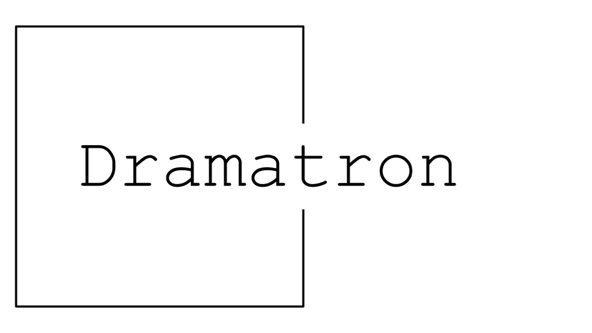

# Dramatron



## Try Dramatron

**Dramatron** can be run using the a web UI or as a Colab.

1. Access the web UI demo [here](https://deepmind.github.io/dramatron/).

1. For full functionality, run the Colab by opening `colab/dramatron.ipynb`. [](https://colab.research.google.com/github/deepmind/dramatron/blob/main/colab/dramatron.ipynb)

## Details

**Dramatron** uses existing, pre-trained large language models to generate long, coherent text and could be useful for authors for **co-writing** theatre scripts and screenplays. Dramatron uses hierarchical story generation for consistency across the generated text. Starting from a log line, Dramatron interactively generates character descriptions, plot points, location descriptions, and dialogue. These generations provide human authors with material for compilation, editing, and rewriting.

Dramatron is conceived as a writing tool and as a source of inspiration and exploration for writers. To evaluate Dramatron’s usability and capabilities, we engaged 15 playwrights and screenwriters in two-hour long user study sessions to co-write scripts alongside Dramatron.

One concrete illustration of how Dramatron can be utilised by creative communities is how one playwright staged 4 heavily edited and rewritten scripts co-written alongside Dramatron. In the public theatre show, *Plays by Bots*, a talented cast of experienced actors with improvisational skills gave meaning to Dramatron scripts through acting and interpretation.

During the development of Dramatron and through discussions with industry professionals, we made several important observations:

* Dramatron is a **co-writing** system that has only been used in collaboration with human writers, and was not conceived or evaluated to be used autonomously.
* Dramatron’s top-down hierarchical story generation structure does not correspond to every writer's writing process.
* The output of a language model may include elements of the text used to train the language model. One possible mitigation is for the human co-writer to search for substrings from outputs to help to identify plagiarism.
* Dramatron may reproduce biases and stereotypes found in the corpus, and may generate offensive text. One possible mitigation is to use the [Perspective API](https://perspectiveapi.com/) for estimating toxicity scores of the language outputs, and filtering generations based on the Perspective API analysis.

In our pre-print paper [Mirowski, Mathewson et al (2022) Co-Writing Screenplays and Theatre Scripts with Language Models: An Evaluation by Industry Professionals](https://arxiv.org/abs/2209.14958) we share many reflections including how playwrights reflected that they "wouldn't use [Dramatron] to write a full play," and that Dramatron's output can be "formulaic." Rather, they would use Dramatron for "world building," for exploring alternative stories by changing characters or plot elements, and for creative idea generation.

Dramatron is a web interface and a Google Colab that interact with a pre-trained Large Language Model (LLM). Currently, Dramatron can be used with OpenAI's GPT-3 LLM. No user input (log lines, other prompts, edits), interactions or API keys are stored by Dramatron. Please refer to OpenAI's <a href='https://openai.com/privacy/'>Privacy Policy</a> and <a href='https://openai.com/terms/'>Terms of Use</a> if you use GPT-3.
      
We are looking forward to learning if and how you might incorporate Dramatron into your own artistic practices. If you’d like to share thoughts, comments, or observations or have any questions, please contact us at dramatron@deepmind.com.

The guide for contributors to Dramatron can be found [here](CONTRIBUTING.md).

## Cite Dramatron

```
@article{mirowski2022cowriting,
  title={Co-Writing Screenplays and Theatre Scripts with Language Models: An Evaluation by Industry Professionals},
  author={Mirowski, Piotr and Mathewson, Kory W and Pittman, Jaylen and Evans, Richard},
  journal={arXiv preprint arXiv:2209.14958},
  year={2022}
}
```

## License and Disclaimer

Copyright 2022 DeepMind Technologies Limited

All software is licensed under the Apache License, Version 2.0 (Apache 2.0);
you may not use this file except in compliance with the Apache 2.0 license.
You may obtain a copy of the Apache 2.0 license at:
https://www.apache.org/licenses/LICENSE-2.0

All other materials are licensed under the Creative Commons Attribution 4.0
International License (CC-BY). You may obtain a copy of the CC-BY license at:
https://creativecommons.org/licenses/by/4.0/legalcode

Unless required by applicable law or agreed to in writing, all software and
materials distributed here under the Apache 2.0 or CC-BY licenses are
distributed on an "AS IS" BASIS, WITHOUT WARRANTIES OR CONDITIONS OF ANY KIND,
either express or implied. See the licenses for the specific language governing
permissions and limitations under those licenses.

This is not an official Google product.
